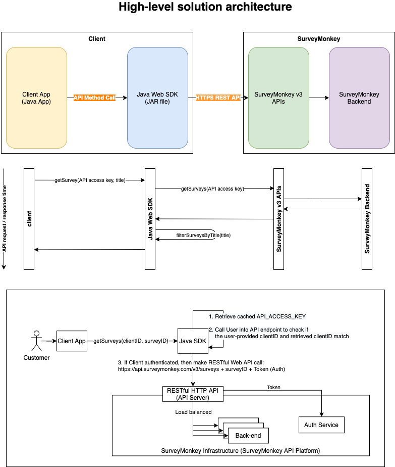

# Java Web SDK for SurveyMonkey v3 APIs

[](https://github.com/masashik/surveymonkey-java-sdk/actions/workflows/maven.yml)

- ### This is a Java client library to work with [SurveyMonkey REST API](https://developer.surveymonkey.com/api/v3/).

#### This is a repository of Java code as an answer to the following SurveyMonkey technical screening interview question.
1. We have a RESTful HTTP API that we provide to our customers. We want to make it easier for them to use in their projects by abstracting common boilerplate away in an SDK. Your task is to implement this SDK in a language of your choice. [The API is documented here](https://developer.surveymonkey.com/api/v3/) We'll constrain the exercise to exposing just a single piece of functionality to your end-users. Your SDK should provide a method that returns all of the surveys belonging to the client. It should allow filtering by ID.
2. Develop a Java Web SDK to consume ~~Banana Stand APIs. The Banana Stand APIs is located at https://app.swaggerhub.com/apis-docs/sseg/banana-stand/1.0.0#/~~
(The Banana Stand APIs are not accessible by invalid certificate error)
**<mark>Use https://developer.surveymonkey.com/api/v3/ instead (You need to create SurveyMonkey developer account at first)</mark>**

3. The coding output requirements are:
	- ~~Try to get list of bananas belongs to a user with filtering the result by Banana status and user~~
	- Try to get a list of surveys belongs to a user with filtering the result by user and a survey ID
	- Consider Authentication and Authorization
	- Implement HTTP request rate limit functionality
	- Consider how to protect or optimize the endpoint if too many HTTP API are requested
	- Consider thread-safety for multithreading execution environment.

## High-level solution design


## Project repository structure
```
 ~/Project/surveymonkey-java-sdk/ [main] tree
.
├── Java_Web_SDK_for_SurveyMonkey_v3_APIs.png (Solution design diagram attached to README.md)
├── LICENSE
├── README.md
└── surveymonkey-java-sdk
    ├── pom.xml
    └── src
        ├── main
        │   └── java
        │       └── com
        │           └── surveymonkey (Java library (JAR file) with source code to abstract SurveyMonkey v3 APIs)
        │               ├── Survey.java
        │               ├── SurveySDKClientApp.java
        │               └── SurveyService.java
        └── test
            └── java
                └── com
                    └── surveymonkey
                        └── SurveyServiceUnitTests.java

10 directories, 8 files
```

## Testing
#### In testing, the following concerns must be addressed.

1. **Scalability & Reliability**: High-volume traffic to handle thousands of requests a second in a reliable and performant way of the method
2. **Thread-safety**: Concurrent access to the method in a multithreading environment
3. **Fault-tolerant**: Failure handling with smooth error recovery with circuit breaker
4. **Robust**: Good coverage of unit, integration, and end-to-end testing
5. **Authentication and authorization**: Accept only authenticated and correctly authorized API requests

## Usage

1. Add the following maven repository information and dependency to your pom.xml

```xml
<distributionManagement>
   <repository>
     <id>github</id>
     <name>GitHub masashik Apache Maven Packages</name>
     <url>https://maven.pkg.github.com/masashik/surveymonkey-java-sdk</url>
   </repository>
</distributionManagement>
```

```xml
<dependency>
  <groupId>com.surveymonkey</groupId>
  <artifactId>surveymonkey-java-sdk</artifactId>
  <version>1.0-SNAPSHOT</version>
</dependency>
```

2. Download and install the SDK (JAR file - Java Library) into your Java Maven project with following command.

```bash
mvn install
```

3. In the main class of your Java code, importing
```java
package com.surveymonkey;

import java.util.List;
import com.surveymonkey.surveymonkey-java-sdk.SurveyService;

public class SurveySDKClientApp {

  /**
   * This is a client application using the Java Web SDK of SurveyMonkey v3 APIs.
   */

  public static void main(String[] args) {
    SurveyService service = new SurveyService("API ACCESS KEY GOES HERE");
    List<Survey> filteredResult = service.getSurveyWithFilter("survey");
    System.out.println("Program exit on success");
  }
}
```
## References

- [API v.s. SDK](https://rapidapi.com/blog/api-vs-sdk/)
- [API v.s. Library](https://rapidapi.com/blog/api-vs-library/)
- [The Web SDK](https://help.sap.com/viewer/8b8d6fffe113457094a17701f63e3d6a/GIGYA/en-US/417f1e0c70b21014bbc5a10ce4041860.html)
- [Java example to validate JWT](https://help.sap.com/viewer/8b8d6fffe113457094a17701f63e3d6a/GIGYA/en-US/417f310970b21014bbc5a10ce4041860.html)
